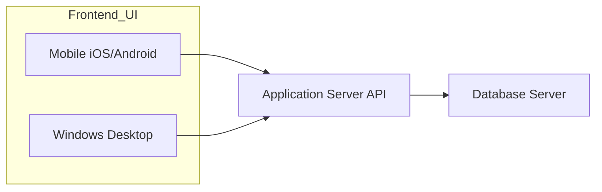

# AIMCPSample

AIMCPSample is a cross-platform example application demonstrating how to use voice input to interact with AI via the MCP tool. The project is built with .NET MAUI Blazor and runs on Android, iOS, and Windows devices.

## Project Purpose

This project aims to modernize the mainstream traditional system architecture, where the frontend UI (mobile: iOS/Android, Windows desktop, etc.) communicates with the application server via APIs, which in turn interacts with the database server.  
With AIMCPSample, an AI assistant interface is added to the frontend. This AI assistant can automate operations and management of existing IT systems by interacting with an AI model, which then calls an additional MCP server. The MCP server, in turn, communicates with the application server API, enabling intelligent and automated workflows.

## Architecture Comparison

### Traditional System Architecture


 
### With AI Assistant and MCP Server

```mermaid
  flowchart LR 
    subgraph Frontend_UI 
      A3[AI Assistant Interface] 
      A1[Mobile iOS/Android] 
      A2[Windows Desktop] 
    end 
    subgraph New_Features[" "] 
       direction LR 
          A3 --> D[AI Model] 
          D --> E[MCP Server] 
          E --> B[Application Server API]          
    end     
    style New_Features stroke:#28a745,stroke-width:3px 
    B --> C[Database Server] 
    A1 & A2 --> B  
```


## Features

- 🎤 **Voice Input**: Use your device's microphone to ask questions by voice.
- 🤖 **AI Integration**: Interact with AI services using the MCP tool.
- 💬 **Chat Interface**: View conversation history and responses.
- 📱 **Cross-Platform**: Works on Android, iOS, and Windows (via .NET MAUI Blazor).

## Getting Started

### Prerequisites

- [.NET 9 SDK](https://dotnet.microsoft.com/download/dotnet/9.0)
- Visual Studio 2022 (with MAUI and Blazor workloads)
- A supported device or emulator (Android, iOS, or Windows)

### Build and Run

1. **Clone the repository:**

2. **Open the solution in Visual Studio 2022.**

3. **Restore NuGet packages and build the solution.**

4. **Run the project** on your preferred platform (Android, iOS, or Windows).

### Usage

- Click the microphone button to start recording your question.
- Click the checkmark to stop recording and send your voice input to the AI.
- View AI responses in the chat area.
- You can also type your question manually.

## License

This project is licensed under the MIT License. See the [LICENSE](LICENSE) file for details.

## Acknowledgements

- [.NET MAUI](https://github.com/dotnet/maui)
- [Blazor](https://dotnet.microsoft.com/apps/aspnet/web-apps/blazor)
- [Bootstrap Icons](https://icons.getbootstrap.com/)

> **Note:** This is a sample project for educational and demonstration purposes.

